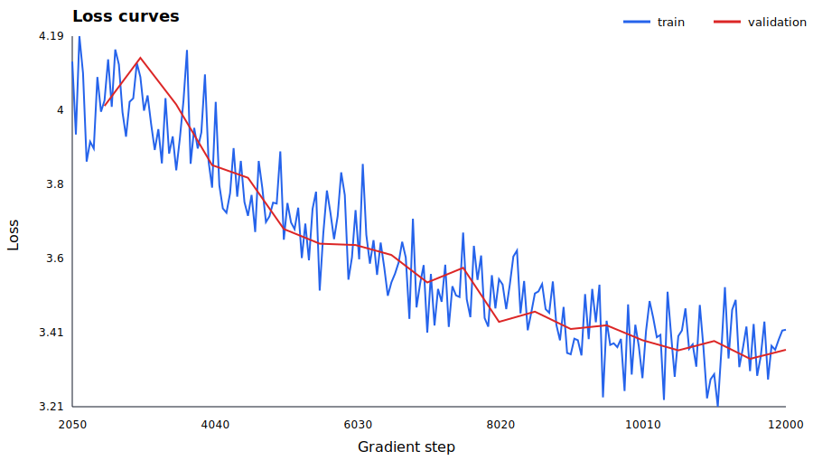
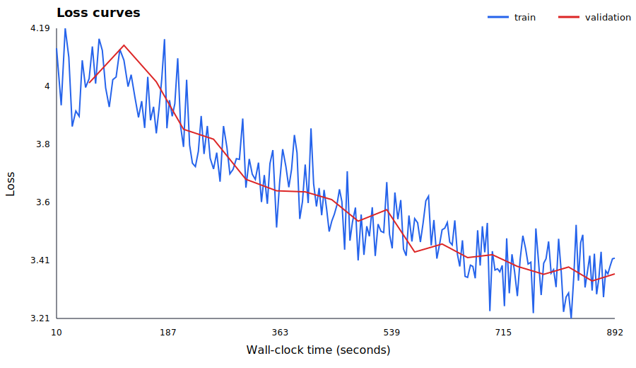
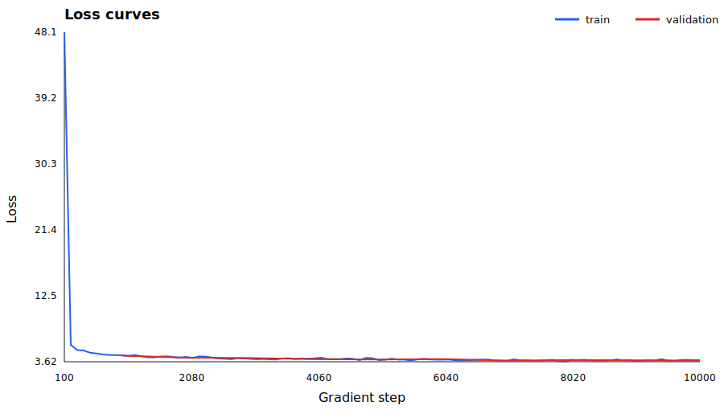

# CS336 Assignment 1: Basics

This repository contains my implementation of the CS336 Assignment 1 basics stack:
BPE tokenizer training, Transformer language model components, AdamW training, checkpointing,
and TinyStories experiments.

The original course handout is kept at [cs336_assignment1_basics.pdf](./cs336_assignment1_basics.pdf).

## What is implemented

- Byte-pair encoding tokenizer training and serialization.
- Transformer LM modules: embeddings, linear layers, RMSNorm, RoPE, attention, SwiGLU, and full model.
- Training loop with checkpoint resume, cosine learning-rate schedule, gradient clipping, and CSV metrics.
- CUDA speed path for TinyStories: bf16 autocast, TF32, fused AdamW, scaled-dot-product attention, and optional `torch.compile`.
- Text generation from trained checkpoints with temperature and top-p sampling.

## TinyStories setup

The local experiment used a 10k-token BPE vocabulary and encoded TinyStories arrays:

| Item | Value |
| --- | --- |
| Vocabulary size | 10,000 |
| Context length | 256 |
| Model width | 512 |
| Layers | 4 |
| Heads | 16 |
| FFN dimension | 1,344 |
| Training data | TinyStories train, encoded to `.npy` locally |
| Validation data | TinyStories valid, encoded to `.npy` locally |
| Device | `cuda:0` |

Large local artifacts such as `.npy` datasets and `.pt` checkpoints are intentionally not committed.
The committed experiment files are only the lightweight configs, CSV metrics, and SVG loss curves used below.

## Experiment results

| Run | Steps covered | Batch size | LR | Final train loss | Final val loss | Elapsed | Throughput |
| --- | ---: | ---: | ---: | ---: | ---: | ---: | ---: |
| `tinystories_fast_iter_20260705_125652` | 100 to 10,000 | 32 | 1e-3 | 3.826 | 3.767 | 19.0 min | 71.9k tok/s |
| `tinystories_fast_ft_12k_20260705_134613` | 2,050 to 12,000 | 32 | 3e-3 | 3.415 | 3.361 | 14.9 min | 110.3k tok/s |

The second run resumed from `checkpoints/tinystories_baseline.pt` and continued the same model with a higher
learning rate and smaller minimum LR. It reached the best recorded validation loss in this local run set.

### Experiment metadata

| Run | Started at | Resume source | Max iters | Warmup | Min LR | Log every | Eval every | Val iters | Speed options | Files |
| --- | --- | --- | ---: | ---: | ---: | ---: | ---: | ---: | --- | --- |
| `tinystories_fast_iter_20260705_125652` | 2026-07-05 12:56:59 | fresh run | 10,000 | 100 | 1e-4 | 100 | 1,000 | 3 | bf16, fused AdamW, `torch.compile`, SDPA, TF32 | [config](./experiments/tinystories_fast_iter_20260705_125652/config.json), [metrics](./experiments/tinystories_fast_iter_20260705_125652/metrics.csv) |
| `tinystories_fast_ft_12k_20260705_134613` | 2026-07-05 13:46:19 | `checkpoints/tinystories_baseline.pt` | 12,000 | 100 | 3e-5 | 50 | 500 | 5 | bf16, fused AdamW, `torch.compile`, SDPA, TF32 | [config](./experiments/tinystories_fast_ft_12k_20260705_134613/config.json), [metrics](./experiments/tinystories_fast_ft_12k_20260705_134613/metrics.csv) |

The aggregate local experiment index is committed at [experiments/experiment_log.csv](./experiments/experiment_log.csv).
Dates above are the local timestamps written by the training script on TSUBAME.

### Loss curves

Training and validation loss by step:



Training and validation loss by wall-clock time:



For comparison, the 10k fast iteration run:



## Sample generations

Generated from `checkpoints/tinystories_baseline.pt` with `temperature=0.8`, `top_p=0.9`.

Prompt:

```text
Once upon a time, there was a little girl named Lily
```

Output excerpt:

```text
Once upon a time, there was a little girl named Lily. Lucy loved to play with his friend. One day, Spot saw a big forest with her room to look. One saw a big bird with her mom. She was happy to play with her mom.
One sunny day, Bob saw a big box. She wanted to take and play. She tried to make her mom. She looked everywhere his big, "Why are you?" Her mom said, "Don't worry, but only to see the toy food."
The bird was surprised, and they became good friends.
```

Prompt:

```text
Tom found a shiny red ball in the garden
```

Output excerpt:

```text
Tom found a shiny red ball in the garden. He said, "I'm a toy!" So, Tim and Sam laughed and said, "Yes, Tim! You are so tasty."
Tom and his mom watched his friends. They saw the ball and watched. They had fun and played until they could play. Tim said, "Let, Tim! Let's play together!"
Tim and Sam became friends.
```

The samples show that the model learned TinyStories-like structure, names, simple dialogue, and short narrative arcs,
but grammar and entity consistency are still weak at this small scale.

## Reproduce

Install and run tests:

```sh
uv run pytest
```

Run a fast TinyStories experiment on CUDA:

```sh
./scripts/train_tinystories_fast_iter.sh
```

Generate from a trained local checkpoint:

```sh
uv run python -m cs336_basics.Generate \
  --checkpoint checkpoints/tinystories_baseline.pt \
  --vocab artifacts/tinystories_vocab_10k.json \
  --merges artifacts/tinystories_merges_10k.json \
  --prompt "Once upon a time" \
  --max-new-tokens 120 \
  --temperature 0.8 \
  --top-p 0.9 \
  --device cuda:0 \
  --no-compile-model
```

Detailed TSUBAME notes are in [cs336_basics/TSUBAME_TRAINING_GUIDE.md](./cs336_basics/TSUBAME_TRAINING_GUIDE.md).
